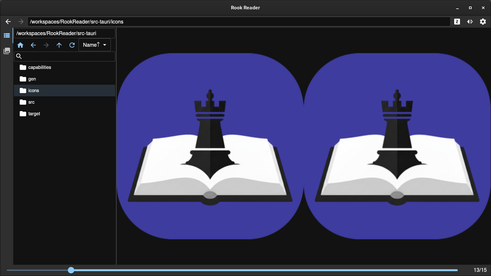

# RookReader


[](https://v2.tauri.app/ja/)
[](https://react.dev/)
[](https://www.typescriptlang.org/)
[](https://rust-lang.org/)
[](LICENSE)

[English](README.md) | [日本語](docs/ja_JP/README.md)

## Overview

RookReader is a modern, fast, cross-platform application for viewing e-book files in zip, rar, and pdf formats. It is available for Windows and Linux environments.

It supports image sequences (such as comics and magazines) contained in a directory, common archive files and PDF documents, and is specialized for the reading experience of Japanese novels and comics.

## Features

* **Support for Japanese vertical writing (right-to-left binding):** Standard support for right-to-left page turning, which is natural when reading vertically written novels and manga.
* **Cross-platform support:** Available on Windows and Linux.
* **Supported file formats:**
  * zip
  * rar
  * pdf
* **Modern UI/UX:** An intuitive and easy-to-use interface built with React + TypeScript.
* **High performance:** Near-native performance and memory efficiency with a Rust backend and the Tauri framework.

## Installation

Pre-built binaries of the application are available on the GitHub Releases page.
Please follow the steps below to download and install the appropriate file for your environment.

1. Go to the [latest release](https://github.com/Rookro/RookReader/releases/latest/) on the RookReader GitHub Releases page.
1. Download the appropriate file for your operating system and follow the corresponding installation method.

### Windows

| File Name | Installation Guide |
| -- | -- |
| RookReader_x.x.x_x64-setup.exe | Download and run the executable installer. |
| RookReader_x.x.x_x64_xx-XX.msi | Download and run the MSI installer. |

###  Linux

| Distribution | Recommended File | Installation Guide |
| -- | -- | -- |
| Debian/Ubuntu/Mint | RookReader_x.x.x_amd64.deb | Double-click the file, or use `sudo dpkg -i <filename>` in the terminal. |
| Arch Linux/Manjaro | RookReader_x.x.x_amd64.deb | See [Arch Linux Instructions](#arch-linux-instructions) below. |
| Fedora/RHEL/openSUSE | RookReader_x.x.x-x.x86_64.rpm | Use `sudo dnf install <filename>` (or `sudo yum install <filename>`) in the terminal. |
| Other Distributions (Universal) | RookReader_x.x.x_amd64.AppImage | Grant execution permission (`chmod +x <filename>`), then run the file. No installation required. |

#### Arch Linux Instructions

For users running Arch Linux or Manjaro, you can build and install the package using the provided PKGBUILD.

1. Download the following files:

   | File Name | Location |
   | -- | -- |
   | RookReader_x.x.x_amd64.deb |  Github Releases |
   | PKGBUILD | Repository Root |
   | RookReader.install | Repository Root |

1. Place all downloaded files in the same directory.
1. Open the terminal, navigate to that directory, and run the following command to build and install the package:

   ``` bash
   makepkg -si
   ```

   This command will build the package based on the PKGBUILD and install it, handling dependencies.

## Usage



* **Open a file:**
  * Click an archive file or directory in the left pane (File Navigator).
  * Drag and drop an archive file or directory onto the application window.

* **Navigate through pages:**
  * Click the image display area to turn to the next page, and right-click to turn to the previous page.
  * You can also navigate through pages using the mouse wheel or the arrow keys.

## Development Environment

This project recommends a development flow using DevContainer to minimize environmental differences between developers.

### Prerequisites

*   Docker: Required for using container technology.
*   VS Code (Visual Studio Code)
*   VS Code Remote - Containers extension: An extension for using DevContainer in VS Code.

### Setup

1.  Clone this repository.

    ```bash
    git clone https://github.com/Rookro/RookReader.git
    ```

1.  Open the cloned folder in VS Code.
1.  Click the "Reopen in Container" pop-up that appears in the bottom right of VS Code, or open the Command Palette (Ctrl+Shift+P or Cmd+Shift+P) and select `Remote-Containers: Open Folder in Container...`.
1.  Once the DevContainer has finished building and starting, a development environment with all the necessary dependencies (Rust, Node.js, etc.) will be available.

### Build

You can build within the DevContainer using the following commands.

```bash
yarn
yarn tauri build
```

Alternatively, you can simply run the following to build:

```bash
./build-linux.sh
```

## Contributing

Contributions to this project are welcome.

For bug reports and feature suggestions, please use GitHub Issues.
For code contributions, please send a Pull Request.

## LICENSE

This project is licensed under the [MIT License](LICENSE).
