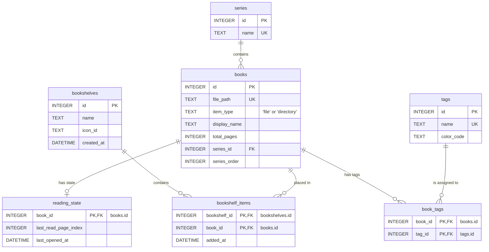

```mermaid
erDiagram
    series ||--o{ books : "contains"
    books ||--o| reading_state : "has state"
    bookshelves ||--o{ bookshelf_items : "contains"
    books ||--o{ bookshelf_items : "placed in"
    books ||--o{ book_tags : "has tags"
    tags ||--o{ book_tags : "is assigned to"

    books {
        INTEGER id PK
        TEXT file_path UK
        TEXT item_type "'file' or 'directory'"
        TEXT display_name
        INTEGER total_pages
        INTEGER series_id FK
        INTEGER series_order
    }
    
    series {
        INTEGER id PK
        TEXT name UK
    }
    
    reading_state {
        INTEGER book_id PK, FK "books.id"
        INTEGER last_read_page_index
        DATETIME last_opened_at
    }

    bookshelves {
        INTEGER id PK
        TEXT name
        TEXT icon_id
        DATETIME created_at
    }

    bookshelf_items {
        INTEGER bookshelf_id PK, FK "bookshelves.id"
        INTEGER book_id PK, FK "books.id"
        DATETIME added_at
    }
    
    tags {
        INTEGER id PK
        TEXT name UK
        TEXT color_code
    }
    
    book_tags {
        INTEGER book_id PK, FK "books.id"
        INTEGER tag_id PK, FK "tags.id"
    }
```
