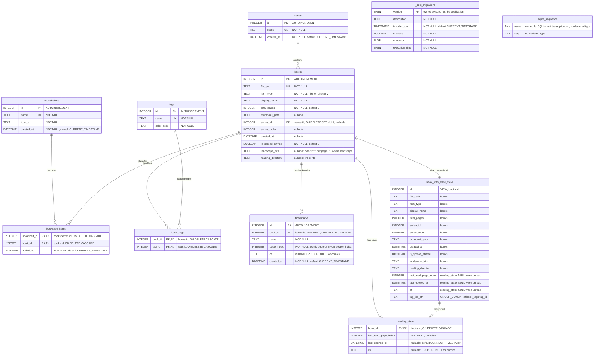

## Notes

`book_with_state_view` is a view, not a table: it joins each book to its reading state and
its tag ids so a book and its progress can be read in one query. It carries every `books`
column, so any column added there must be added to the view as well — SQLite has no
`CREATE OR REPLACE VIEW`, so a migration drops and recreates it.

`_sqlx_migrations` is created and maintained by the sqlx migration runner, and
`sqlite_sequence` by SQLite itself to hold the `AUTOINCREMENT` counters. Both are listed
because they exist in the database file, but neither is application schema and neither is
written by application code.

## Indexes

Besides the implicit indexes SQLite creates for primary keys and `UNIQUE` columns:

| Index | Definition |
| --- | --- |
| `idx_reading_state_last_opened_at` | `reading_state (last_opened_at DESC)` |
| `idx_bookmarks_book_id` | `bookmarks (book_id)` |
