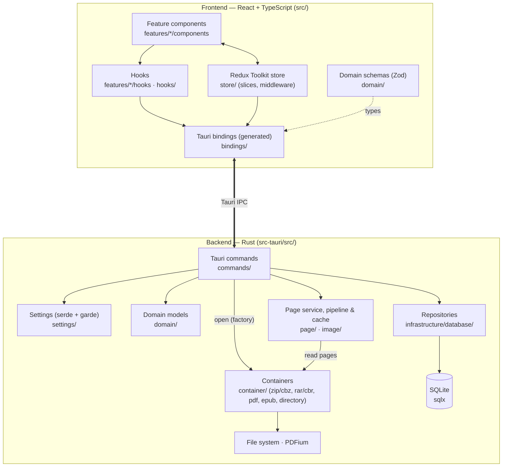
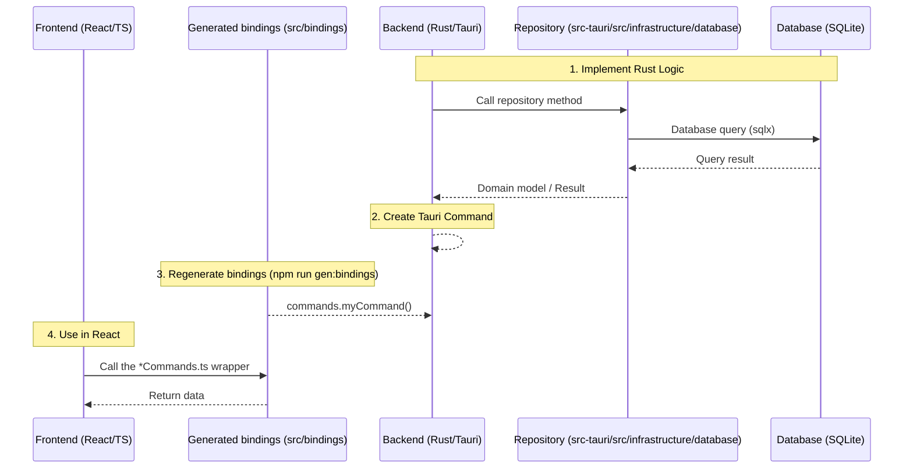

<!-- Source of truth: docs/wiki/ in https://github.com/Rookro/RookReader. Edit it there (same PR as the code change); the GitHub Wiki is overwritten on every release. -->

Welcome to the Developer Guide for RookReader. This page explains the architecture, development setup, and contribution workflows.

## Architecture Overview

RookReader uses Tauri, combining a high-performance Rust backend with a modern React (TypeScript) frontend. The frontend follows a Feature-Sliced layout (`src/features/`), the backend a domain / infrastructure split with the Repository pattern, and the two communicate through TypeScript bindings **generated from the Rust command signatures** by `tauri-specta`.



### Frontend Details

- **Feature-Sliced layout:** each feature lives under `src/features/<Feature>/` (`BookReader`, `Bookshelf`, `History`, `MainView`, `Settings`, `SidePane`, `Updater`) with its own `components/`, `hooks/` and Redux `slice.ts`. Generic, feature-independent hooks (`useAppTheme`, `useDragDropEvent`, `usePaneSizes`, `useResizeObserver`, `useTauriEvent`) live in `src/hooks/`.
- **UI Components:** Built functionally using React and composed heavily of **Material UI (MUI)** components. We utilize MUI's `sx` prop and theming system (`src/hooks/useAppTheme.ts`) for responsive and consistent styling. Icons are imported by path (`@mui/icons-material/<Icon>`) so only the icons in use are bundled.
- **State Management:** Global state is managed via **Redux Toolkit**. `src/store/store.ts` builds the store, `src/store/rootReducer.ts` combines the feature slices (`read`, `bookmark`, `view`, `history`, `bookCollection`, `tag`, `series`, `settings`, `settingsError`), and `src/store/middleware/` holds the `loggerMiddleware` and the `readingStateMiddleware` that persists reading progress asynchronously. Component-specific UI state relies on standard React hooks (`useState`, `useReducer`).
- **Bindings (generated):** `src/bindings/bindings.ts` (command wrappers and the TypeScript types of every Rust type they use, including the settings model) and `src/bindings/errorCodes.ts` are **generated** from Rust by `tauri-specta` via `npm run gen:bindings` — never edit them by hand. `src/bindings/*Commands.ts` are thin wrappers that delegate to the generated `commands.*`, unwrap the `{ status, data | error }` result with `runCommand` (`src/bindings/result.ts`, which throws a `CommandError`) and narrow the results to the `src/domain/` types; binary commands that return a raw `tauri::ipc::Response` keep a direct `invoke`.
- **Domain & validation:** `src/domain/` holds Zod schemas for the entities (book, bookmark, bookshelf, series, tag). Application **settings** are validated in Rust (see below); the frontend consumes the generated types and the backend's field errors (`src/features/Settings/settingsFieldErrors.ts`, bounds mirrored in `settingsBounds.json`).
- **Errors:** the numeric `ErrorCode` values are owned by Rust (`ErrorCode::code()` in `src-tauri/src/error.rs`); `src/types/Error.ts` re-exports the generated codes and adds the frontend-only `unknown` sentinel.
- **i18n:** `react-i18next` with `src/i18n/locales/en-US.json` and `ja-JP.json`.

### Backend Details

- **Tauri Commands:** The entry points for the frontend (`src-tauri/src/commands/`): `book`, `bookmark`, `bookshelf`, `container`, `directory`, `font`, `series`, `settings`, `tag` and `updater` commands act as controllers. Every command carries `#[tauri::command]` + `#[specta::specta]` and is registered in `specta_builder()` in `src-tauri/src/lib.rs`.
- **Domain:** `src-tauri/src/domain/` holds the domain models (book, bookmark, bookshelf, series, tag) shared by commands and repositories.
- **Repository Pattern:** All database queries are isolated in `src-tauri/src/infrastructure/database/` (`book_repository`, `bookmark_repository`, `bookshelf_repository`, `series_repository`, `tag_repository`, `models`). This abstracts the compile-time-checked `sqlx` SQLite queries away from the command logic.
- **Containers:** File parsing logic is separated into `src-tauri/src/container/`: `zip_container` (zip/cbz), `rar_container` (rar/cbr), `pdf_container` + `pdf_worker` (a single process-wide PDFium worker), `epub_container`, `directory_container`, plus `archive_listing`/`archive_path` for browsing and addressing folders inside an archive. `factory.rs` picks the container from the file extension.
- **Page service & pipeline:** when a book is opened, the command creates its container through `factory.rs` and hands it to a `PageService` (`src-tauri/src/page/service.rs`), which owns the container for the life of the book. The service schedules page reads on its worker threads (`container.open_reader()` → `read_page()`), the `Pipeline` (`page/pipeline.rs` with `src-tauri/src/image/` `resizer`/`thumbnail`) decodes and resizes the bytes to the viewer's display size, and `page/cache.rs` keeps the results. Containers are the only layer that touches the file system or PDFium; the pipeline only sees bytes. `src-tauri/src/state/` holds the shared application/container state.
- **Settings:** `src-tauri/src/settings/` is the source of truth for the settings model (`model.rs`), its validation (`serde` for shape, `garde` for bounds — see `validation.rs`), patching (`patch.rs`) and file persistence (`provider.rs`).
- **Errors & logging:** `src-tauri/src/error.rs` defines the `Error` enum (`thiserror`) and its `ErrorCode` discriminants with stable numeric codes; logging goes through the `log` crate and `tauri-plugin-log` (`setup.rs`). `perf.rs` records timings at debug level.

### Key Technologies

- **Frontend:** React 19, TypeScript, Vite 8, Material UI (MUI), Redux Toolkit, Zod, react-i18next, foliate-js (EPUB rendering).
- **Backend:** Rust, Tauri (v2), SQLite (sqlx), garde (settings validation), pdfium-render (bundled PDFium).
- **Tooling:** tauri-specta (generated bindings), Biome (lint/format), Vitest (frontend unit tests), WebdriverIO (E2E), cargo-about (license files).

## Development Environment Setup

We highly recommend using DevContainers for a consistent development environment. The container already includes Rust, Node.js, `sqlx-cli`, `cargo-about` and vcpkg, and builds libdav1d (for AVIF pages) when it is created.

If you work natively instead, you need: Node.js (v22 or higher), Rust via `rustup`, the [Tauri prerequisites](https://tauri.app/start/prerequisites/) for your OS, `sqlx-cli` (`cargo install sqlx-cli`), `cargo-about` (`cargo install cargo-about --locked --features cli`) and, on Windows, vcpkg for libdav1d — see `CONTRIBUTING.md`; on Linux use the Dev Container. `cargo-about` is mandatory: `npm run dev` and `npm run build` generate the third-party license files with it and fail without it.

1. Clone the repository: `git clone https://github.com/Rookro/RookReader.git`
1. Open the folder in VS Code (or another DevContainer-compatible editor).
1. If using VS Code, when prompted, click **Reopen in Container** (requires the Dev Containers extension). This will automatically set up Rust, Node.js, and other dependencies.
1. Prepare the database and start the development server inside the container:

   ```bash
   npm install
   cd src-tauri
   cargo sqlx database setup
   cd ..
   npm run tauri dev
   ```

### Branching model

The project follows [Git Flow](https://nvie.com/posts/a-successful-git-branching-model/): `develop` is the integration branch for the next release and `main` always reflects the latest released version. Create your branch **from `develop`** (e.g. `feature/<short-description>` or `bugfix/<short-description>`) and open your Pull Request **against `develop`**. Commit messages loosely follow [Conventional Commits](https://www.conventionalcommits.org/) (`feat:`, `fix:`, `docs:`, `test:`, `ci:` …). See [CONTRIBUTING.md](https://github.com/Rookro/RookReader/blob/main/CONTRIBUTING.md) for the full guide.

### Documentation (this wiki)

These pages are sourced from [`docs/wiki/`](https://github.com/Rookro/RookReader/tree/main/docs/wiki) in the main repository and pushed to the GitHub Wiki automatically on every release, so edit them there — in the same Pull Request as the change they describe — and never on the wiki directly. `npm run check:wiki` verifies that the pages only reference existing paths and npm scripts and that the settings reference matches the code.

## Database Migrations & Setup

RookReader uses `sqlx` for compile-time checked SQLite queries. The `sqlx-cli` tool is required for managing migrations.
The current schema (books, series, bookshelves, bookshelf_items, tags, book_tags, reading_state, bookmarks, and the `book_with_state_view` view) is documented as an ER diagram in [`docs/database/er_diagram.md`](https://github.com/Rookro/RookReader/blob/main/docs/database/er_diagram.md).

### Modifying the Database Schema

If you need to change the database schema (e.g., adding a new table or column):

1. **Create a new migration:** Use the `sqlx-cli` to generate the migration files. Run the following command inside the `src-tauri` directory:
   ```bash
   cargo sqlx migrate add -r <migration_name>
   ```
   This will create a new set of `.sql` files in the `src-tauri/migrations/` directory. `sqlx` applies these migrations in order.
1. **Apply migrations locally:** After writing your SQL schema changes in the generated files, apply them to your local database to test your changes:
   ```bash
   cargo sqlx migrate run
   ```
1. **Update sqlx query data:** Because the project uses `SQLX_OFFLINE=true` in its build pipeline (including CI/CD), you **must** update the cached query metadata whenever you modify database queries or the schema.
   
   Run the following command inside the `src-tauri` directory:
   ```bash
   cargo sqlx prepare
   ```
   This will update the `.sqlx` directory. Ensure you commit these changes along with your PR.

## How to Add a New Feature

When adding a feature that requires both frontend and backend changes, follow this workflow:



### Steps

1. **Rust Logic**: Add or update the domain model in `src-tauri/src/domain/`, repository logic in `src-tauri/src/infrastructure/database/` (Repository pattern), or container logic in `src-tauri/src/container/`. Handle errors explicitly with `Result` — never `.unwrap()`/`.expect()` in production code — and log with the `log` crate, not `println!`.
1. **Tauri Command**: Create a command in `src-tauri/src/commands/` annotated with `#[tauri::command]` **and** `#[specta::specta]`, documented with `# Arguments` / `# Returns` / `# Errors`. Register it in `src-tauri/src/lib.rs` inside `specta_builder()`'s `collect_commands![...]`. Only commands that return a raw `tauri::ipc::Response` (binary payloads) go into the small separate `generate_handler!` instead.
1. **TypeScript Binding**: Run `npm run gen:bindings` (it runs the `export_bindings` / `export_error_codes` tests in `src-tauri/src/lib.rs`). This regenerates `src/bindings/bindings.ts` (and `errorCodes.ts`) from Rust — do not edit them by hand. Then add or extend the thin wrapper in the matching `src/bindings/*Commands.ts` (e.g. `BookCommands.ts`) that delegates to the generated `commands.myCommand` and narrows the result to the `src/domain/` type. Commit the regenerated files; CI runs `npm run gen:bindings:check` and fails on drift.
1. **New error codes**: add a variant to the `Error` enum in `src-tauri/src/error.rs` (its `ErrorCode` discriminant is derived automatically), give it a `code()` arm with a stable number, and regenerate; never hand-edit `src/bindings/errorCodes.ts`.
1. **React Integration**: Use the wrapper in a Redux thunk (`createAsyncThunk` in the feature's `slice.ts`) or a custom hook under `src/features/<Feature>/hooks/`. Add user-facing strings to `src/i18n/locales/en-US.json` and `ja-JP.json`, and log through `@tauri-apps/plugin-log` rather than `console`.

## Testing & QA

Run the same checks CI enforces before opening a Pull Request:

| Check | Command |
| :--- | :--- |
| TypeScript type check | `npx tsc --noEmit` |
| Frontend lint & format (Biome) | `npm run check` (auto-fix: `npm run check:fix`) |
| Rust format | `cargo fmt --all` (run from `src-tauri/`) |
| Rust lint | `cargo clippy --all-targets --all-features -- -D warnings` (run from `src-tauri/`) |
| Generated TypeScript bindings are up to date | `npm run gen:bindings:check` |
| Wiki pages reference existing paths, scripts and settings | `npm run check:wiki` |
| Frontend unit tests (Vitest) | `npm run test:frontend` (coverage: `npm run test:frontend:coverage`) |
| Rust tests | `npm run test:backend` |
| Both test suites | `npm run test` |
| End-to-end tests (WebdriverIO) | `npm run test:e2e` |

Notes:
- The E2E suite builds the app with the `e2e-test` Cargo feature, which embeds a WebDriver server; no external `tauri-driver` or `msedgedriver` is required. On Linux without a display run it as `xvfb-run --auto-servernum -- npm run test:e2e`. E2E runs against an isolated temporary data directory (passed through the `ROOKREADER_DATA_DIR` environment variable, which debug builds honour too), so your real library is untouched.
- `npm run licenses` generates the third-party license files with `cargo-about` and `generate-license-file`; CI runs it explicitly, and `dev`, `build` and `test:backend` run it for you.
- On Debian/Ubuntu the native build needs `libwebkit2gtk-4.1-dev libayatana-appindicator3-dev librsvg2-dev patchelf` (plus `xvfb` for headless E2E) — the list CI and the devcontainer install.
